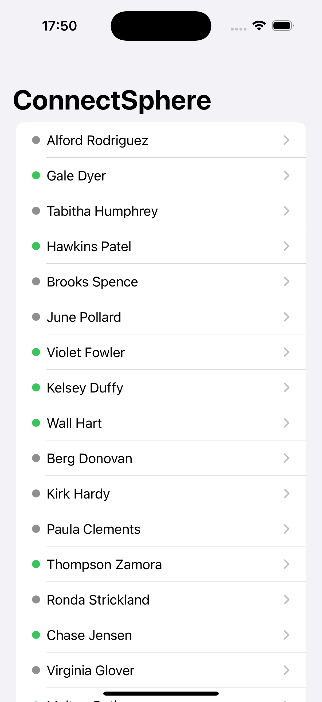

# ConnectSphere 🌐

*A simple and elegant iOS app built with SwiftUI to browse user profiles fetched from a remote JSON API. This project is a solution to the "FriendFace" challenge from Paul Hudson's 100 Days of SwiftUI course.*

## Screenshot

## About The Project

ConnectSphere is a client application that demonstrates key iOS development skills. It fetches a list of users from a network endpoint, parses the complex JSON data, and presents it in a clean, multi-screen, navigable interface. The main goal was to practice data fetching, decoding, and presentation using modern SwiftUI techniques.

## Features

- Fetches user data from a remote API using `URLSession`.
- Parses complex JSON into Swift models using `Codable`.
- Displays a master list of users with their online status.
- Provides a detail view for each user, showing comprehensive information including their list of friends.
- Built entirely with SwiftUI.

## Technologies Used

- SwiftUI
- URLSession & Codable
- `async/await`
- Swift
